<p align="center">
  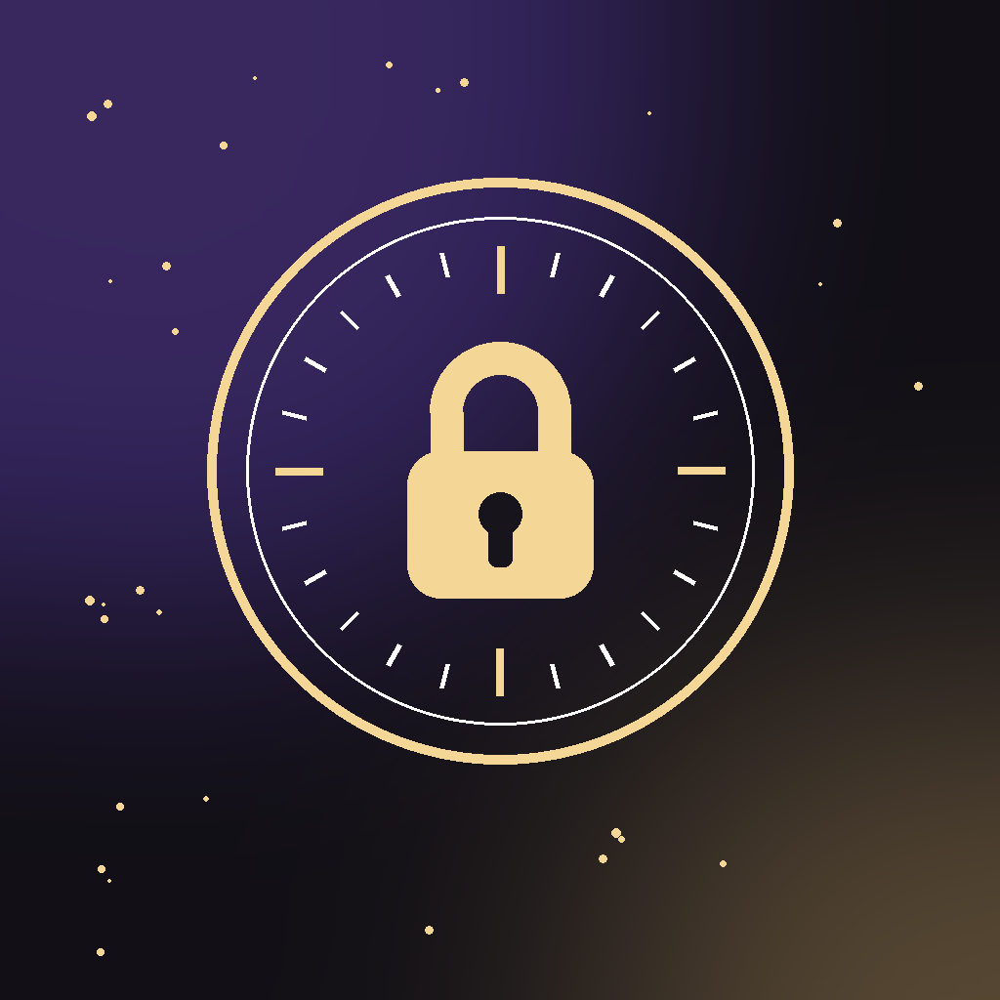
</p>

<h1 align="center">Capsule</h1>

<p align="center">
  <em>A locked vault for trip memories. Friends seal videos and photos all trip long — nobody can look, not even the uploader — and when the timer runs out, everyone experiences a cinematic reveal together.</em>
</p>

<p align="center">
  <b>Native iOS · SwiftUI · 34 source files · 12 end-to-end UI tests · solo project</b>
</p>

---

## The idea

Friend groups already do this by hand: they make a Snapchat group called *"do not open"*, dump the trip into it, and sit together at the end to watch it back. Capsule turns that ritual into a product — and makes the "do not open" part real. Once a memory is sealed it is **cryptographically inaccessible until the unlock moment** (server-enforced rules, not a client-side hide), and the opening is staged like a Spotify Wrapped for your trip rather than a folder of files.

## What it looks like

| Entrance | Home | Create a vault | Collecting |
|:-:|:-:|:-:|:-:|
| 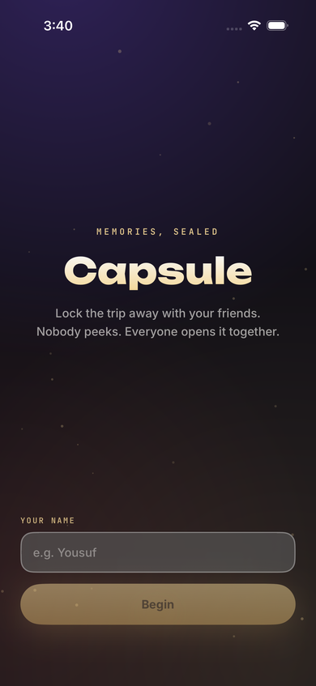 | 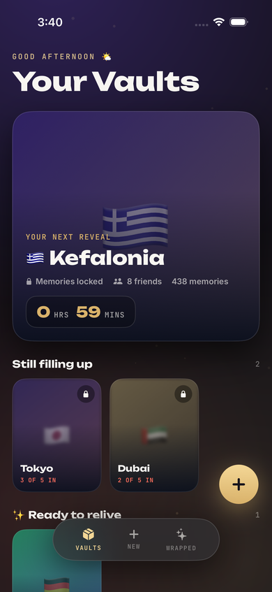 | 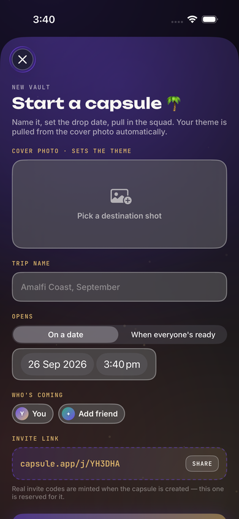 | 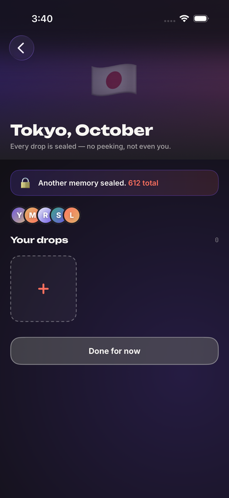 |

| Countdown | Unseal | Intro card | Trip by the numbers |
|:-:|:-:|:-:|:-:|
| 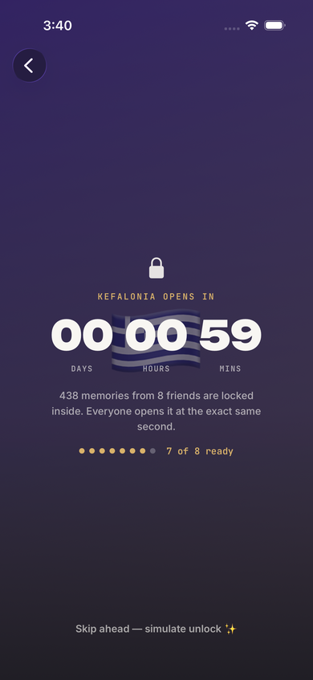 | 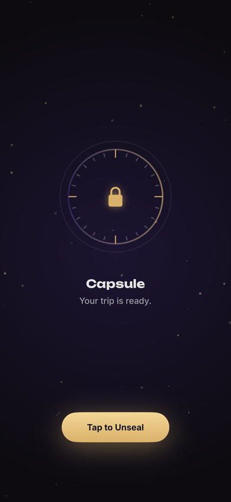 | 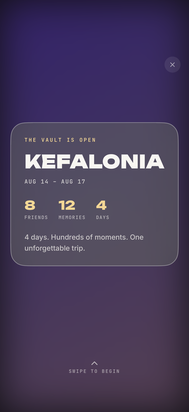 | 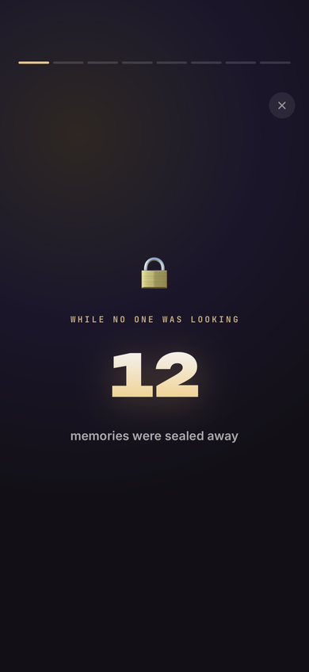 |

| The journey | Album | Quiz | Wrapped |
|:-:|:-:|:-:|:-:|
| 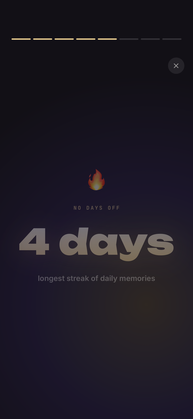 | 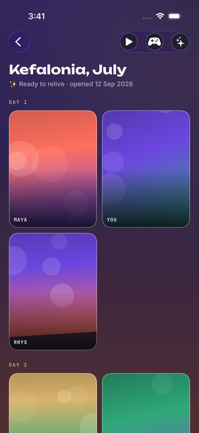 | 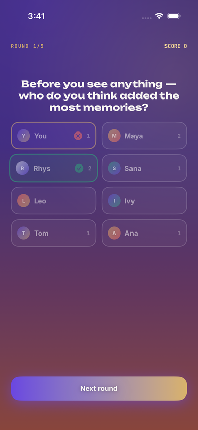 | 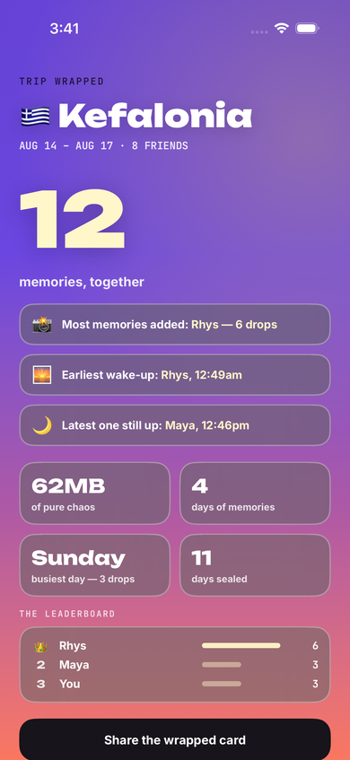 |

## Features

- **Vaults** with a name, cover photo, invite code / share link and an unlock condition (a date & time, or "when everyone's ready").
- **Blind contribution** — photos and videos are sealed on upload. The collecting grid shows only pixelated locked thumbnails (for videos, derived from the first frame). An **offline-tolerant upload queue** stages media on disk and drains when connectivity returns.
- **Live countdown** everywhere the vault appears; when it reaches zero the vault unlocks by itself — on the countdown screen (with a fireworks burst), from Home, or after the app was closed (foreground sweep).
- **The Trip Replay** — a five-stage ceremony: *tap-to-unseal vault dial → blurred-hero intro card → 5–8 dynamically chosen stat slides with animated count-ups → a chaptered journey (Arrival, Day Two, Sunset, Goodbye…) that plays every video in full with sound and curated photos with ken-burns motion → "Until the next adventure."* Replayable from the album any time.
- **Solo trivia** on the trip ("who took this?", "which day?"), and a **Wrapped** stats screen with a shareable card rendered via `ImageRenderer`.
- **Per-trip theming** — two dominant colours are extracted from the cover photo with Core Image's k-means filter and drive every gradient, glow and accent on that trip's screens.
- **A cinematic shell** — deep charcoal, purple/gold/coral glows, drifting golden dust, spring-physics cards, staged entrances.

## Architecture

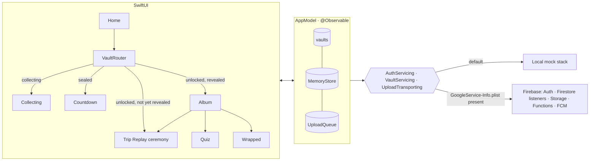

- **Vault lifecycle** is a state machine `collecting → sealed → unlocked`, with `hasCompletedReveal` gating ceremony vs. album. `VaultRouter` re-routes reactively the instant state changes, so the unlock never needs a navigation push.
- **Trust boundary.** In the live stack, `firebase/firestore.rules` and `storage.rules` deny *all* reads of sealed media — for every member — until a Cloud Function (the only writer of `state`) flips the vault to `unlocked`. See [`docs/BACKEND_SETUP.md`](docs/BACKEND_SETUP.md).
- **Backend selection** is automatic: the app is written against protocols; `BackendFactory` picks Firebase when the SDK and config are present, otherwise the local mock. Nothing above the service layer knows the difference.
- **Stat selection** scores ~12 candidate statistics per trip for "interestingness" and keeps the top 5–8, so the replay stays 30–60 s and never feels like a dashboard.

Full design write-up: [`docs/PROJECT_REPORT.md`](docs/PROJECT_REPORT.md).

## Running it

```bash
git clone https://github.com/Yousuf6273/Capsule.git
open Capsule/Capsule.xcodeproj      # Xcode 16+, iOS 17+
```
Pick an iPhone simulator, **⌘R**. Sign in with any name. The demo path: tap the **Kefalonia** hero → *Skip ahead — simulate unlock* → **Tap to Unseal** and watch the ceremony. Create your own vault with an unlock time a few minutes out to see the real countdown → fireworks → reveal.

**Tests:** ⌘U, or

```bash
xcodebuild test -project Capsule.xcodeproj -scheme Capsule \
  -destination 'platform=iOS Simulator,name=iPhone 17 Pro'
```
Twelve XCUITest scenarios drive the real app end-to-end: sign-in, every sheet and back-navigation path (no dead ends), the collecting flow, the countdown reaching zero *without* any tap, the already-expired edge case, the full ceremony, the solo quiz, sharing, and replay. They launch with `--uitest-reset` for deterministic state.

## Status

| Area | State |
|---|---|
| App, design system, ceremony, quiz, album, theming | ✅ complete |
| Offline upload queue, video pipeline (audio, full length, poster frames) | ✅ complete |
| Automated end-to-end tests | ✅ 12 scenarios, all passing |
| Server-enforced lock (rules + Cloud Functions) | ✅ written; deploy per `docs/BACKEND_SETUP.md` |
| Realtime multi-user sync, post-unlock media download, push client | ✅ written (compile-gated on the Firebase SDK) |
| Live Firebase project | ⏳ requires the owner's Firebase account (~30 min, guide included) |
| App Store / TestFlight | ⏳ requires Apple Developer Program |

## Stack

Swift 5 · SwiftUI · Observation · PhotosUI · AVFoundation / AVKit · Core Image (`CIKMeans`) · Canvas + TimelineView animations · XCTest UI testing · Firebase (Auth, Firestore, Storage, Functions, Messaging) · TypeScript Cloud Functions

## License

MIT — see [LICENSE](LICENSE). Fonts under the SIL OFL.
